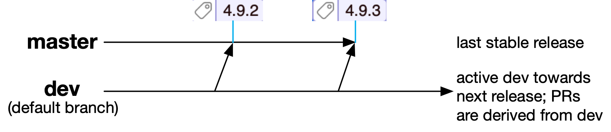

# ANTLR v4

[](http://java.oracle.com)
[](https://raw.githubusercontent.com/antlr/antlr4/master/LICENSE.txt)


**ANTLR** (ANother Tool for Language Recognition) is a powerful parser generator for reading, processing, executing, or translating structured text or binary files. It's widely used to build languages, tools, and frameworks. From a grammar, ANTLR generates a parser that can build parse trees and also generates a listener interface (or visitor) that makes it easy to respond to the recognition of phrases of interest.

**Dev branch build status**

[](https://github.com/antlr/antlr4/actions/workflows/hosted.yml) (github actions)

<!--
* [](https://github.com/antlr/antlr4/actions/workflows/windows.yml) (github actions)

* [](https://app.circleci.com/pipelines/github/antlr/antlr4) (CircleCI)

[](https://ci.appveyor.com/project/parrt/antlr4) 
[](https://travis-ci.com/github/antlr/antlr4)
-->

## Repo branch structure

The default branch for this repo is [`master`](https://github.com/antlr/antlr4/tree/master), which is the latest stable release and has tags for the various releases; e.g., see release tag [4.9.3](https://github.com/antlr/antlr4/tree/4.9.3).  Branch [`dev`](https://github.com/antlr/antlr4/tree/dev) is where development occurs between releases and all pull requests should be derived from that branch. The `dev` branch is merged back into `master` to cut a release and the release state is tagged (e.g., with `4.10-rc1` or `4.10`.) Visually our process looks roughly like this:



Targets such as Go that pull directly from the repository can use the default `master` branch but can also pull from the active `dev` branch:

```bash
$ go get github.com/antlr/antlr4/runtime/Go/antlr@dev
```

## Authors and major contributors

* [Terence Parr](http://www.cs.usfca.edu/~parrt/), parrt@cs.usfca.edu
ANTLR project lead and supreme dictator for life
[University of San Francisco](http://www.usfca.edu/)
* [Sam Harwell](http://tunnelvisionlabs.com/) (Tool co-author, Java and original C# target)
* [Eric Vergnaud](https://github.com/ericvergnaud) (Javascript, Python2, Python3 targets and maintenance of C# target)
* [Peter Boyer](https://github.com/pboyer) (Go target)
* [Mike Lischke](http://www.soft-gems.net/) (C++ completed target)
* Dan McLaughlin (C++ initial target)
* David Sisson (C++ initial target and test)
* [Janyou](https://github.com/janyou) (Swift target)
* [Ewan Mellor](https://github.com/ewanmellor), [Hanzhou Shi](https://github.com/hanjoes) (Swift target merging)
* [Ben Hamilton](https://github.com/bhamiltoncx) (Full Unicode support in serialized ATN and all languages' runtimes for code points > U+FFFF)
* [Marcos Passos](https://github.com/marcospassos) (PHP target)
* [Lingyu Li](https://github.com/lingyv-li) (Dart target)
* [Ivan Kochurkin](https://github.com/KvanTTT) has made major contributions to overall quality, error handling, and Target performance.
* [Justin King](https://github.com/jcking) has done a huge amount of work across multiple targets, but especially for C++.
* [Ken Domino](https://github.com/kaby76) has a knack for finding bugs/issues and analysis; also a major contributor on the [grammars-v4 repo](https://github.com/antlr/grammars-v4).
* [Jim Idle](https://github.com/jimidle) has contributed to previous versions of ANTLR and recently jumped back in to solve a major problem with the Go target.


## Useful information

* [Release notes](https://github.com/antlr/antlr4/releases)
* [Getting started with v4](https://github.com/antlr/antlr4/blob/master/doc/getting-started.md)
* [Official site](http://www.antlr.org/)
* [Documentation](https://github.com/antlr/antlr4/blob/master/doc/index.md)
* [FAQ](https://github.com/antlr/antlr4/blob/master/doc/faq/index.md)
* [ANTLR code generation targets](https://github.com/antlr/antlr4/blob/master/doc/targets.md)<br>(Currently: Java, C#, Python2|3, JavaScript, Go, C++, Swift, Dart, PHP)
* [Java API](http://www.antlr.org/api/Java/index.html)
* [ANTLR v3](http://www.antlr3.org/)
* [v3 to v4 Migration, differences](https://github.com/antlr/antlr4/blob/master/doc/faq/general.md)

You might also find the following pages useful, particularly if you want to mess around with the various target languages.
 
* [How to build ANTLR itself](https://github.com/antlr/antlr4/blob/master/doc/building-antlr.md)
* [How we create and deploy an ANTLR release](https://github.com/antlr/antlr4/blob/master/doc/releasing-antlr.md)

## The Definitive ANTLR 4 Reference

Programmers run into parsing problems all the time. Whether it’s a data format like JSON, a network protocol like SMTP, a server configuration file for Apache, a PostScript/PDF file, or a simple spreadsheet macro language—ANTLR v4 and this book will demystify the process. ANTLR v4 has been rewritten from scratch to make it easier than ever to build parsers and the language applications built on top. This completely rewritten new edition of the bestselling Definitive ANTLR Reference shows you how to take advantage of these new features.

You can buy the book [The Definitive ANTLR 4 Reference](http://amzn.com/1934356999) at amazon or an [electronic version at the publisher's site](https://pragprog.com/book/tpantlr2/the-definitive-antlr-4-reference).

You will find the [Book source code](http://pragprog.com/titles/tpantlr2/source_code) useful.

## Additional grammars
[This repository](https://github.com/antlr/grammars-v4) is a collection of grammars without actions where the
root directory name is the all-lowercase name of the language parsed
by the grammar. For example, java, cpp, csharp, c, etc...
