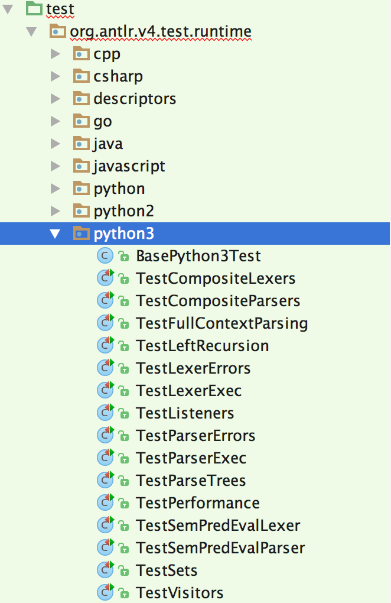
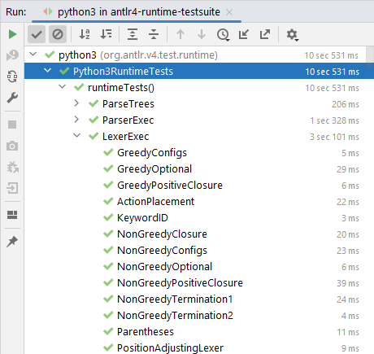

# ANTLR project unit tests

## Introduction

Because ANTLR supports multiple target languages, the unit tests are broken into two groups:
the unit tests that test the tool itself (in `tool-testsuite`) and the unit tests that test the parser runtimes (in `antlr4/runtime-testsuite`).
The tool tests are straightforward because they are Java code testing Java code; see the section at the bottom of this file.

The runtime tests must be specified in a generic fashion to work across language targets.
Furthermore, the various targets from Java must be tested.

This usually means Java launching processes to compile, say, C++ and run parsers.

As of 4.10, a Java descriptor file held as an [RuntimeTestDescriptor.java](../runtime-testsuite/test/org/antlr/v4/test/runtime/RuntimeTestDescriptor.java)
is used to represent each runtime test.

Each test is described with a text file with various sections and resides in a group directory;
see [directories under descriptors' dir](../runtime-testsuite/resources/org/antlr/v4/test/runtime/descriptors).
Here is a sample test descriptor:

```
[notes]
This is a regression test for blah blah blah...

[type]
Parser

[grammar]
grammar T;
a : ID* {
<writeln("$text")>
};
ID : 'a'..'z'+;
WS : (' '|'\n') -> skip;

[start]
a

[input]
a b c

[output]
"""abc
"""
```

The grammars are strings representing StringTemplates (`ST` objects) so `<writeln("$text")>` will get replace when the unit test file is generated (`Test.java`, `Test.cs`, ...).
The `writeln` template must be defined per target.
Here are all the 
[Target templates for runtime tests](../runtime-testsuite/resources/org/antlr/v4/test/runtime/templates).
Use triple-quotes `"""` when whitespace matters (usually input/output sections).

## Requirements

In order to perform the tests on all target languages, the following tools should be installed:

* dotnet
* Node.js
* Python 2
* Python 3
* Go
* Swift
* Clang (Linux, Mac) or MSBuild (Windows) for C++
* Dart
* PHP

To **install into local repository** `~/.m2/repository/org/antlr`, do this:

```bash
$ export MAVEN_OPTS="-Xmx1G"  # don't forget this on linux
$ mvn install -DskipTests     # make sure all artifacts are visible on this machine
```

## Running the runtime tests

A single test rig is sufficient to test all targets against all descriptors using the [junit dynamic tests](https://junit.org/junit5/docs/current/user-guide/#writing-tests-dynamic-tests) mechanism.
But it's often convenient to test just a single target or perhaps even just a single test within a single group of a single target.
IntelliJ automatically generates a bunch of
[Target runtime test rigs](../runtime-testsuite/test/org/antlr/v4/test/runtime) that allows developers such flexibility.
For example, here are the Python3 test rigs in IntelliJ:



And the result of testing the entire subdirectory:



All test are run in parallel both via maven and via IDE.

In IntelliJ, it's very easy to go to source by right-clicking on any test and pressing `Jump to source` (F4).

## Running test subsets

From the `runtime-testsuite` dir

### Run all tests for a single target

```bash
$ cd runtime-testsuite
$ export MAVEN_OPTS="-Xmx1G"     # don't forget this on linux
$ mvn -Dtest=java.** test
-------------------------------------------------------
 T E S T S
-------------------------------------------------------
[INFO] Running org.antlr.v4.test.runtime.java.TestIntegerList
[INFO] Running org.antlr.v4.test.runtime.java.JavaRuntimeTests
...
[INFO] Tests run: 6, Failures: 0, Errors: 0, Skipped: 0, Time elapsed: 0.023 s - in org.antlr.v4.test.runtime.java.TestIntegerList
[INFO] Tests run: 348, Failures: 0, Errors: 0, Skipped: 0, Time elapsed: 19.269 s - in org.antlr.v4.test.runtime.java.JavaRuntimeTests
...
```

## Adding a runtime test

To add a new runtime test, first determine which [group (dir) of tests](../runtime-testsuite/resources/org/antlr/v4/test/runtime/descriptors) it belongs to.
Then, add a new descriptor file implementation by filling in one of these (omitting unused sections):

```
[notes]

[type]

[grammar]

[slaveGrammar]

[start]

[input]

[output]

[errors]

[flags]

[skip]
```

Your best bet is to find a similar test in the appropriate group and then copy and paste the descriptor file, creating a new file within the test group dir.
Modify the sections to suit your new problem.
 
### Ignoring tests

In order to turn off a test for a particular target, the `skip` section in the descriptor file should be used.
For example, the following skips PHP and Dart targets:

```
[skip]
PHP
Dart
```

### Target API/library testing

Some parts of the runtime API need to be tested with code written specifically in the target language.
For example, all the Java runtime API tests are placed here:

[runtime-testsuite/test/org/antlr/v4/test/runtime/java/api](../runtime-testsuite/test/org/antlr/v4/test/runtime/java/api)

Notice that it is under an `api` dir. The directory above is where all of the `*Test*` files go.

### Cross-language actions embedded within grammars

To get:

```
System.out.println($set.stop);
```

Use instead the language-neutral:

```
<writeln("$set.stop")>
```

Template file [Java.test.stg](../runtime-testsuite/resources/org/antlr/v4/test/runtime/templates/Java.test.stg) has templates like:

```
writeln(s) ::= <<System.out.println(<s>);>>
```

that translate generic operations to target-specific language statements or expressions.

## Adding an ANTLR tool unit test

Just go into the appropriate Java test class in dir [antlr4/tool-testsuite/test/org/antlr/v4/test/tool](../tool-testsuite/test/org/antlr/v4/test/tool) and add your unit test.


