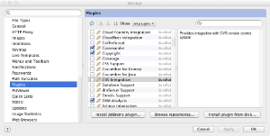

# Java

## Development environments

### Intellij

There is a very complete and useful plug-in for intellij 12-14, you can grab at the [download page](https://plugins.jetbrains.com/plugin/7358?pr=). Check the [plugin readme](https://github.com/antlr/intellij-plugin-v4) for feature set. Just go to the preferences and click on the "Install plug-in from disk..." button from this dialog box:



Select the intellij-plugin-1.x.zip (or whatever version) file and hit okay or apply. It will ask you to restart the IDE. If you look at the plug-ins again, you will see:


Also, I have prepared a [video](https://youtu.be/eW4WFgRtFeY) that will help you generate grammars and so on using ANTLR v4 in Intellij (w/o the plugin).

### Eclipse

Edgar Espina has created an [eclipse plugin for ANTLR v4](https://marketplace.eclipse.org/content/antlr-ide). Features: Advanced Syntax Highlighting, Automatic Code Generation (on save), Manual Code Generation (through External Tools menu), Code Formatter (Ctrl+Shift+F), Syntax Diagrams, Advanced Rule Navigation between files (F3), Quick fixes.

### NetBeans

Sam Harwell's [ANTLRWorks2](http://tunnelvisionlabs.com/products/demo/antlrworks) works also as a plug-in, not just a stand-alone tool built on top of NetBeans.

## Build systems

### ant

### mvn

*Maven Plugin Reference*

The reference pages for the latest version of the Maven plugin for ANTLR 4 can be found here:

[http://www.antlr.org/api/maven-plugin/latest/index.html](http://www.antlr.org/api/maven-plugin/latest/index.html)

*Walkthrough*

This section describes how to create a simple Antlr 4 project and build it using maven. We are going to use the ArrayInit.g4 example from chapter 3 of the book, and bring it under maven. We will need to rename files and modify them. We will conclude by building a portable stand alone application.

Generate the skeleton. To generate the maven skeleton, type these commands:

```bash
mkdir SimpleAntlrMavenProject
cd SimpleAntlrMavenProject
mvn archetype:generate -DgroupId=org.abcd.examples -DartifactId=array-example -Dpackage=org.abcd.examples.ArrayInit -Dversion=1.0
# Accept all the default values
cd array-example
```

Maven will ask a series of questions, simply accept the default answers by hitting enter.

Move into the directory created by maven:

```bash
cd array-example
```

We can use the find command to see the files created by maven:

```bash
$ find . -type f
./pom.xml
./src/test/java/org/abcd/examples/ArrayInit/AppTest.java
./src/main/java/org/abcd/examples/ArrayInit/App.java
```

We need to edit the pom.xml file extensively. The App.java will be renamed to ArrayInit.java and will contain the main ANTLR java program which we will download from the book examples. The AppTest.java file will be renamed ArrayInitTest.java but will remain the empty test as created by maven. We will also be adding the grammar file ArrayInit.g4 from the book examples in there.

Get the examples for the book and put them in the Downloads folder. To obtain the ArrayInit.g4 grammar from the book, simply download it:

```bash
pushd ~/Downloads
wget http://media.pragprog.com/titles/tpantlr2/code/tpantlr2-code.tgz
tar xvfz tpantlr2-code.tgz
popd
```

Copy the grammar to the maven project. The grammar file goes into a special folder under the src/ directory. The folder name must match the maven package name org.abcd.examples.ArrayInit.

```bash
mkdir -p src/main/antlr4/org/abcd/examples/ArrayInit
cp ~/Downloads/code/starter/ArrayInit.g4 src/main/antlr4/org/abcd/examples/ArrayInit
```

Copy the main program to the maven project. We replace the maven App.java file with the main java program from the book. In the book, that main program is called Test.java, we rename it to ArrayInit.java:

```bash
# Remove the maven file
rm ./src/main/java/org/abcd/examples/ArrayInit/App.java
# Copy and rename the example from the book
cp ~/Downloads/code/starter/Test.java ./src/main/java/org/abcd/examples/ArrayInit/ArrayInit.java
```

Spend a few minutes to read the main program. Notice that it reads the standard input stream. We need to remember this when we run the application.

Edit the ArrayInit.java file. We need to add a package declaration and to rename the class. Edit the file ./src/main/java/org/abcd/examples/ArrayInit/ArrayInit.java in your favorite editor. The head of the file should look like this when you are done:

```java
package org.abcd.examples.ArrayInit;
import org.antlr.v4.runtime.*;
import org.antlr.v4.runtime.tree.*;
 
public class ArrayInit {
...
```

Edit the ArrayInitTest.java file. Maven creates a test file called AppTest.java, we need to rename it to match the name of our application:

```bash
pushd src/test/java/org/abcd/examples/ArrayInit
mv AppTest.java ArrayInitTest.java
sed 's/App/ArrayInit/g' ArrayInitTest.java >ArrayInitTest.java.tmp
mv ArrayInitTest.java.tmp ArrayInitTest.java
popd
```

Edit the pom.xml file. Now we need to extensively modify the pom.xml file. The final product looks like this:

```xml
<project xmlns="http://maven.apache.org/POM/4.0.0" xmlns:xsi="http://www.w3.org/2001/XMLSchema-instance"
  xsi:schemaLocation="http://maven.apache.org/POM/4.0.0 http://maven.apache.org/xsd/maven-4.0.0.xsd">
  <modelVersion>4.0.0</modelVersion>
  <groupId>org.abcd.examples</groupId>
  <artifactId>array-init</artifactId>
  <version>1.0</version>
  <packaging>jar</packaging>
  <name>array-init</name>
  <url>http://maven.apache.org</url>
  <properties>
    <project.build.sourceEncoding>UTF-8</project.build.sourceEncoding>
  </properties>
  <dependencies>
    <dependency>
      <groupId>org.antlr</groupId>
      <artifactId>antlr4-runtime</artifactId>
      <version>4.9.3</version>
    </dependency>
    <dependency>
      <groupId>junit</groupId>
      <artifactId>junit</artifactId>
      <version>4.13.1</version>
    </dependency>
  </dependencies>
  <build>
    <plugins>
      <!-- This plugin sets up maven to use Java 7 -->
      <plugin>
        <groupId>org.apache.maven.plugins</groupId>
        <artifactId>maven-compiler-plugin</artifactId>
        <version>3.1</version>
        <configuration>
          <source>1.8</source>
          <target>1.8</target>
        </configuration>
      </plugin>
      <!-- Plugin to compile the g4 files ahead of the java files
           See https://github.com/antlr/antlr4/blob/master/antlr4-maven-plugin/src/site/apt/examples/simple.apt.vm
           Except that the grammar does not need to contain the package declaration as stated in the documentation (I do not know why)
           To use this plugin, type:
             mvn antlr4:antlr4
           In any case, Maven will invoke this plugin before the Java source is compiled
        -->
      <plugin>
        <groupId>org.antlr</groupId>
        <artifactId>antlr4-maven-plugin</artifactId>
        <version>4.9.3</version>
        <executions>
          <execution>
            <goals>
              <goal>antlr4</goal>
            </goals>
          </execution>
        </executions>
      </plugin>
      <!-- plugin to create a self-contained portable package
           This allows us to execute our application like this:
           java -cp target/array-init-1.0-jar-with-dependencies.jar org.abcd.examples.ArrayInit.ArrayInit
         -->
      <plugin>
        <artifactId>maven-assembly-plugin</artifactId>
        <configuration>
          <descriptorRefs>
            <descriptorRef>jar-with-dependencies</descriptorRef>
          </descriptorRefs>
        </configuration>
        <executions>
          <execution>
            <id>simple-command</id>
            <phase>package</phase>
            <goals>
              <goal>attached</goal>
            </goals>
          </execution>
        </executions>
      </plugin>
    </plugins>
  </build>
</project>
```

This concludes the changes we had to make. We can look at the list of files we have with the find command:

```bash
$ find . -type f
./pom.xml
./src/test/java/org/abcd/examples/ArrayInit/ArrayInitTest.java
./src/main/antlr4/org/abcd/examples/ArrayInit/ArrayInit.g4
./src/main/java/org/abcd/examples/ArrayInit/ArrayInit.java
```

Building a stand alone application. With all the files now in place, we can ask maven to create a standalone application. The following command does this:

```bash
mvn package
```

Maven creates a self-contained jar file called target/array-init-1.0-jar-with-dependencies.jar. We can execute the jar file, but remember that it expects some input on the command line, which means the command will hang on the command line until we feed it some input:

```bash
java -cp target/array-init-1.0-jar-with-dependencies.jar org.abcd.examples.ArrayInit.ArrayInit
```

And let's feed it the following input:

```bash
{1,2,3}
^D
```

The ^D signals the end of the input to the standard input stream and gets the rest of the application going. You should see the following output:

```bash
(init { (value 1) , (value 2) , (value 3) })
```

You can also build a jar file without the dependencies, and execute it with a maven command instead:

```bash
mvn install
mvn exec:java -Dexec.mainClass=org.abcd.examples.ArrayInit.ArrayInit
{1,2,3}
^D
```
